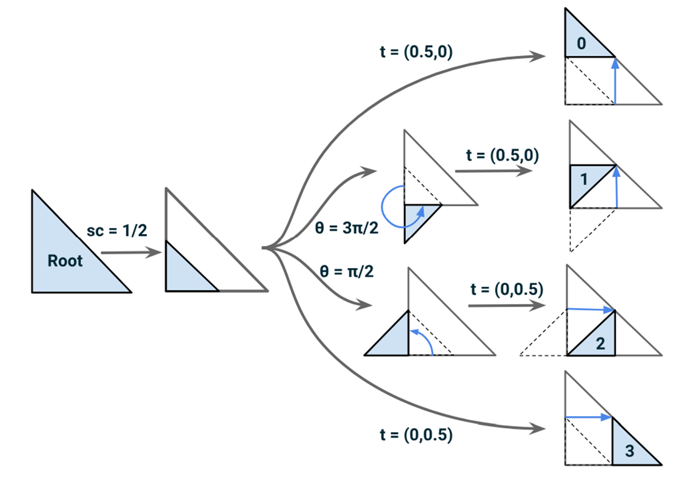

# Meshing Around: Dynamic Adaptive Tessellation using D3D12 Mesh Shaders

* An implementation of [Adaptive GPU Tessellation with Compute Shaders by Jad Khoury, Jonathan Dupuy, and Christophe Riccio](https://onrendering.com/data/papers/isubd/isubd.pdf) in DirectX12.  
* Based on the GDC Talk [Re-inventing the wheel for snow rendering](https://www.gdcvault.com/play/1028844/Advanced-Graphics-Summit-Reinventing-the) presented at GDC 2023 by [Paolo Surricchio](https://www.linkedin.com/in/paolosurricchio/).  
* Started as an Independent Study in Spring 2024 under [Professor Adam Mally](https://directory.seas.upenn.edu/adam-david-mally/) during my Masters in Computer Graphics & Game Technology at the University of Pennsylvania.

* Developer: **Saksham Nagpal**
  * [LinkedIn](https://www.linkedin.com/in/nagpalsaksham/)
  * [Portfolio](https://www.thecapablesnakekeeper.com/)
* Tested on: Windows 11 Home, AMD Ryzen 7 6800H Radeon @ 3.2GHz 16GB, NVIDIA GeForce RTX 3050 Ti Laptop GPU 4096MB

|||
|:-:|:-:|
|||

## Table of Contents
- [Meshing Around:Dynamic Adaptive Tessellation using D3D12 Mesh Shaders](#meshing-arounddynamic-adaptive-tessellation-using-d3d12-mesh-shaders)
  - [Table of Contents](#table-of-contents)
  - [Motivation](#motivation)
  - [Goals](#goals)
  - [Learning DirectX12](#learning-directx12)
  - [Learning about Mesh Shaders](#learning-about-mesh-shaders)
  - [On-The-Fly OBJ Meshletization](#on-the-fly-obj-meshletization)
  - [Geometry Creation on the GPU using Mesh Shaders](#geometry-creation-on-the-gpu-using-mesh-shaders)
  - [Researching existing work](#researching-existing-work)
  - [Implementation: Tessellation](#implementation-tessellation)
  - [The Dilemma, and my 2 Mesh Shader Pipelines](#the-dilemma-and-my-2-mesh-shader-pipelines)
  - [Results - Dynamic Tessellation](#results---dynamic-tessellation)
  - [Results - Adaptive Tessellation](#results---adaptive-tessellation)
  - [Ongoing \& Future Work](#ongoing--future-work)

## Motivation

 GDC Talk on God of War: Ragnarok's Snow Rendering 
    

* In Fall 2023, I started learning about Mesh Shaders, and at the same time came across the 2023 GDC Talk [Re-inventing the wheel for snow rendering](https://www.gdcvault.com/play/1028844/Advanced-Graphics-Summit-Reinventing-the) given by [Paolo Surricchio](https://www.linkedin.com/in/paolosurricchio/), a Senior Staff Rendering Programmer at Santa Monica Studio.
* In the talk, Paolo talks about how the crazy volumes of snow in God of War: Ragnarok for Fimbulwinter posed a challenge to their existing methodology of rendering snow using Screen-Space Parallax Mapping. Some key take-aways regarding the issues were:  
  *  Variable rendering cost, worst when snow looks the best - not ideal for a LOT of snow required in Ragnarok
  *  Needs a lot of hand tuning
  *  Artifacts like these:  
 

* His team ran some tests and found that geometry displacement in selective areas would align with their performance requirements as well as art direction:
  * A quick test by the rendering team using the hardware tessellation pipeline: 
  * An image shared in the talk. The yellow area shows sparse, large triangles as hardly any detail is required, in contrast to the red area marking a section of terrain needing much more detail: 
* Paolo also talks on a high level about their solution to the above problem, and this is how I understood it:
  * A compute shader divides the terrain mesh into meshlets: 
  * It then decides whether to draw the meshlet with the regular vertex pipeline or with the hardware tessellation: 
    

 And it got me thinking... 
    

* Well, SMS is using Compute Shaders to chop up meshes into **meshlets**. Mesh Shaders are known to use meshlets for rendering, so can I implement their approach using the same?
* At this point, I only knew that Mesh Shaders, well, existed. I had no technical understanding of what they are, and would need to do a lot of research to understand them.
* I understand that mesh shaders are only supported by modern graphics APIs like Vulkan, D3D12, and Metal, and this is probably why SMS didn't use them because they needed to support older consoles like the PS4 (which don't support Mesh Shaders afaik but I may be wrong). But I haven't really worked deeply with any of these modern APIs, and would need to learn one to begin with.
* Regardless of which API I use, I won't be able to use the Hardware Tessellation pipeline anymore, since Mesh Shaders collapse all the vertex/primitive processing steps in the pipeline before the rasterizer into a single one. So I would need to figure out a compute-based approach to achieve the same (wouldn’t even want to use it even if could, Paulo mentioned a fixed high-entry cost of 30% to 40% even with a passthrough hull shader).

## Goals
* The first task must be learning DirectX12. Why I picked DirectX12? Well, the reasons are selfishly and stupidly twofold:
  * During the entire duration of 2 years of my Masters, I have had some sort of exposure to OpenGL, WebGL, Vulkan, and WebGPU. So this would be a chance to try my hand at something new.
  * My upcoming job requires me to work with DirectX12, so it makes sense for me to get my hands dirty with it already.
* Also, simultaneously, learn about Mesh Shaders - what even are they? Why do they even matter?
* Look for research work (if any) on compute-based tessellation.
* Get to work! Make something!

## Learning DirectX12

I had a strong feeling that this was going to be daunting, and I most definitely was right. Having mostly worked with OpenGL, D3D12 was a bit overwhelming. Having done a school project using Vulkan definitely prepared me, but the task was (and continues to be) challenging nonetheless.
* I first took a look at the [Microsoft Direct3D12 Programming Guide](https://learn.microsoft.com/en-us/windows/win32/direct3d12/creating-a-basic-direct3d-12-component). I was able to match the list of Code Flow to the Vulkan setup on a high level, but it wasn't more helpful beyond that. I did however kept referring back to it time and again as I made progress in my understanding, which was indeed helpful.
* The natural next thing to look into was the [DirectX-Graphics-Samples repo by Microsoft](https://github.com/microsoft/DirectX-Graphics-Samples). I started with the Hello World! examples (as everyone should), but still, they were a bit overwhelming.
* I then came across this exceptional resource: [P. A. Minerva’s walkthroughs of official DirectX Samples](https://paminerva.github.io/LearnDirectX/presentation.html). They go over the Hello World examples by Microsoft, while also breaking down each step along the way. While going through their explanation, I would refer back to the Programming Guide time and again and map each step in both of the resources.

## Learning about Mesh Shaders
This was also a challenging yet interesting task, mostly because not a lot of resources exist out there for the same.
* [NVIDIA's Introduction to Turing Mesh Shaders](https://developer.nvidia.com/blog/introduction-turing-mesh-shaders/) is the first resource that pops up when one searches Google for Mesh Shaders, and naturally this was the first article I read about them. Now having understood Mesh Shaders, I can say that this is a very useful resource. But back when I was starting learning about them, most of it didn't make sense to me. My minimal background in graphics also doesn't help :(
* Next, I came across [this amazing lecture](https://www.youtube.com/watch?v=HH-9nfceXFw) on Compute & Mesh Shaders by [Cem Yuksel](http://www.cemyuksel.com/). This was such a fantastic explanation of what Mesh Shaders are and why they matter. Once I was done with my independent study, I gave a lecture on the same for the CIS5610: Advanced Rendering course at the University of Pennsylvania as I was TAing the course at the time. My material was heavily based off of Cem's lecture. Here is a no-one-asked-for capture from my lecture:  
* Anyway, coming back to Mesh Shaders. To understand them, first I needed to understand about **meshlets** and **meshletization**. In addition to the NVIDIA's article mentioned before, [this Vulkan Mesh Shader Sample](https://github.com/nvpro-samples/gl_vk_meshlet_cadscene) was also really helpful in helping me understand how Mesh Shaders work off of offsets in Vertex/Index/Primitive Buffers for each Meshlet.
* I then came across the article [Performance Comparison of
Meshlet Generation Strategies](https://jcgt.org/published/0012/02/01/paper.pdf) on the [Journal of Computer Graphics Techniques (JCGT)](https://jcgt.org/), and figured that building optimal/performant meshlets is a whole research area of its own, one that was not the scope of my project. [Microsoft's Mesh Shader examples](https://github.com/microsoft/DirectX-Graphics-Samples/blob/master/Samples/Desktop/D3D12MeshShaders/readme.md) used the [DirectXMesh](https://github.com/microsoft/DirectXMesh) for the purposes of meshletization, and I decided to stick with the same. 
* On that note, the Microsoft D3D12MeshShaders examples were extremely helpful to get things going, and gave me a base to start from. I took the basic MeshletRenderer example and started my development on top of that, rather than setting up a project from scratch.
* I then came across [this video by Apple](https://developer.apple.com/videos/play/wwdc2022/10162/) on Procedural Hair Rendering using Metal Mesh Shaders. This was an extremely useful resource to understand:
  * that not all Mesh Shader projects need meshlets, and
  * how can I create geometry directly on the GPU, which would be crucial for me to implement tessellation on the GPU.  

 
At this point, it was time for me to get to work and try some things in Mesh Shaders.

## On-The-Fly OBJ Meshletization
* The DirectX Mesh Shader examples pre-compute the meshlets from files and store them offline in binary files.
* I wanted to be able to provide my own OBJ files and meshletize them, so that I don't need to depend on the one single binary file I had access to from the examples.
* This, while mostly was understanding the Meshletization example, had me fiddling around with the [DirectXMesh](https://github.com/microsoft/DirectXMesh) library trying to understand how it is set up and what parts do I need to use.
* This took me much longer than I expected, but at least I got things working:

|||
|:-:|:-:|
|The dragon model that comes as part of the DirectX example| My own Mario OBJ file successfully meshletized |

## Geometry Creation on the GPU using Mesh Shaders

I first wanted to understand how can I create geometry out of thin air directly on the GPU, without passing any triangle information from the CPU.
* First, I started with trying to show up a single triangle on the screen with its vertices being hard-coded in my Mesh Shader.

|Test|Shader Config|Result|
|:-:|:-:|:-:|
| 1 single triangle 1 Primitive 3 Vertices 3 Threads| MS 3x1x1  Each thread writes one vertex of the triangle | |  
 

* I have one triangle now, great. But the vertex/primitive ratio is pretty bad. So I thought of trying to render a hexagon with a better shader configuration to optimize the vertex/primitive ratio.

|Test|Shader Config|Result|
|:-:|:-:|:-:|
| 6 triangles 6 Primitives 7 Vertices 7 Threads| MS 7x1x1  Each thread writes one vertex of the triangle | |
 

* Now I wanted to see how can I dispatch thousands of the same mesh shader to cause an explosion of gemoetry - so I thought of trying using an **Amplification Shader**. And the result was pretty satisfying - **37.5 Million triangles at 65 FPS!**

|Test|Shader Config|Result|
|:-:|:-:|:-:|
| 37.5 Million triangles **65 FPS!**| AS 1x1x1 MS 2500x2500x1| |

To zoom in, the grid is just the above hexagon repeated throughout space:

| |
|:-:|:-:|

## Researching existing work
As stated before, since I couldn't use the Hardware Tessellation Pipeline offered by the Graphics APIs, I had to find a way to tessellate meshes dynamically in Mesh Shaders on the GPU.
* First, I came across this IEEE paper: [Improving GPU Real-Time Wide Terrain Tessellation Using the New Mesh Shader Pipeline](https://ieeexplore.ieee.org/document/9122336). While the abstract perfectly fitted my requirements, I couldn't use it because of mainly 2 reasons:
  * The paper is just 4 pages and lacks detail. For someone like myself who is so new to all of this, such little information was almost impossible to work with.
  * Their work, from what I could understand, assumed square patches for the terrain. This did not fit well with a meshletized piece of geometry, so I did not spend much time thinking how to forcefully fit their work to my use case.
* I then came across Matthias Englert's work titled [Using Mesh Shaders for Continuous Level-of-Detail Terrain Rendering](https://history.siggraph.org/wp-content/uploads/2022/08/2020-Talks-Englert_Using-Mesh-Shaders-for-Continuous-Level-of-Detail-Terrain.pdf). But this again was hardly 2 pages of work, heavily relying on prior work, and made little sense to me. The do have a [video explanation](https://dl.acm.org/doi/abs/10.1145/3388767.3407391) of their work, but it was hard for me to keep up with their explanation as I didn't know most of the prior work on top of which they build their work.
* Next, I came across Martin Hedberg's Thesis titled: [Rendering of Large Scale Continuous Terrain Using Mesh Shading Pipeline](https://www.diva-portal.org/smash/get/diva2:1676474/FULLTEXT01.pdf). I could understand some of their work and build some intuition, but it was still a little too involved for me to directly get to implementing, that too in Mesh Shaders which I never worked with before.
* The [JCGT article](https://jcgt.org/published/0012/02/01/paper.pdf) I mentioned before was instrumental in pointing me to many of the resources above, and some others which were good to take a quick look at.
* Finally, while I was skimming through the messages on the [DirectX Discord Channel](https://discord.com/invite/directx) to find motivation, I came across this paper: [Adaptive GPU Tessellation with Compute Shaders](https://onrendering.com/data/papers/isubd/isubd.pdf) by Jad Khoury, Jonathan Dupuy, and Christophe Riccio. Their work was easy to understand, and I was confident enough that I will be able to get at least somewhere trying to implement the same. Hence I decided to get started with trying to implement their work. They also provided a link to their repository which gave me an additional reference.
* Jad Khoury's dissertation ["GPU Tessellation with Compute Shaders"](https://jadkhoury.github.io/files/MasterThesisFinal.pdf) was also an excellent resource accompanying their paper.

## Implementation: Tessellation

 Binary Tree Heirarchy 
    

* The first part of the paper talks about how to tessellate one triangle into multiple based on the required tessellation level:  
   
* At each tessellation level, each triangle is split into 2 - as can be seen in the 2 grey triangles in the above picture. Therefore, we can construct a binary tree to store such a hierarchy.
* Each parent has a binary “key” representing its level.
* Each child key gets a 0 or 1 appended to its parent’s key. For example, the child marked below in the 3 red vertices has a key 0100:  
* The paper talks about how one can apply a series of scaling, rotation, and translation operations to the parent vertices based on the child’s key to get the corresponding transformation: 

* At this point, I thought of implementing the tessellation just to make sure that I understood the concept and could correctly write the binary key-based heirarchy to get the correct transformations. Below is a hard-coded tessellation level based proof of concept that I did before proceeding further:

||&rarr;||
|:-:|:-:|:-:|
| 1 triangle hardcoded in Mesh Shader| &rarr;|Tessellation level 2 using the binary key heiracy|

 Barycentric Remapping 
    

* The Tessellation portion considers the base case to be a right triangle, however that will rarely be the case in an actual mesh.
* The paper then talks about how barycentric weights can be used to morph the leaf-space right triangle (in a child's local space) to the object-space triangle (mesh's world space).   (The 'Quadtree' space approach is implemented in their thesis and not in the paper, however the concept remains the same).
* I also got to implementing the barycentric remapping before proceeding to ensure I can map a tessellated triangle back to its position in the mesh.

||&rarr;||
|:-:|:-:|:-:|
| 1 no-right triangle hardcoded in Mesh Shader| &rarr;|Testing 2 different tessellation levels to ensure barycentric mapping works as expected|

## The Dilemma, and my 2 Mesh Shader Pipelines
* In the traditional Meshlet Pipeline, each invocation is responsible for handling one meshlet where each of its threads write the vertices & primitives for the same. This is great for rendering meshlets as-is. But not for my particular use case! Here is why:
  * Each mesh shader can output max 256 vertices/primitives.
  * Meshlets are usually packed to maximize vertex/triangle count.
  * hence, even if we pack 128 triangles, we can’t even tessellate our meshlet even once!
* Therefore, I decided to implement 2 Mesh Shader pipelines:
  * If a meshlet is not supposed to be tessellated, it will be sent down the `traditional Mesh Shader pipeline` where one Mesh Shader invocation will process that meshlet: 
  * However, if a meshlet is marked for being tessellated, it will be sent down the `tessellation mesh shader pipeline` instead - This will invoke an **Amplification Shader** for the meshlet, which will in turn invoke **one Mesh Shader per triangle** for that meshlet, based on the level of tessellation for that triangle: 

## Results - Dynamic Tessellation
* In this implementation, I have an interactive tessellation application with a hard-coded tessellation level - all the meshlets are initially rendered using the traditional pipeline, and clicking on any of them sends them down the tessellation pipeline instead, where the triangles are tessellated using the hard-coded level value. Examples:

|||
|:-:|:-:|
|Dynamic Tessellation on the binary model| Dynamic Tessellation on an OBJ file |

* A comparison across various tessellation levels:

|||||
|:-:|:-:|:-:|:-:|
|No tessellation, traditional mesh shader pipeline| Tessellation level = 1|Tessellation level = 2|Tessellation level = 4|

||
|:-:|
|No tessellation, traditional mesh shader pipeline 201,972 triangles 95 FPS|

||
|:-:|
|Tessellation level = 1 403,944 triangles 72 FPS|

||
|:-:|
|Tessellation level = 2 807,888 triangles 52 FPS|

||
|:-:|
|Tessellation level = 4 1.6 Million triangles 25 FPS|

## Results - Adaptive Tessellation
In the paper, the authors also talk about an adaptive tessellation technique for polygonal geometry that leverages an implicit subdivison scheme for each polygon in the scene. They define a LOD (level-of-detail) function that relies on a distance-based criterion to determine how much a triangle should be tessellated. Here are a couple of results from my implementation of the same:

|||
|:-:|:-:|
|Adaptive Tessellation on the binary model| Adaptive Tessellation on an OBJ file |

## Ongoing & Future Work
I am still learning & exploring, and there is so much that can be done with this project.
* **Vertex Reuse:** The authors in their compute-based model compute duplicate vertices repeatedly across multiple children. I want to try implementing some sort of vertex reuse scheme across children to avoid this duplicacy.
* **Better Scheduling of Workloads:** The shader configurations and thread counts I currently use are in no way optimized, and in fact might be terrile. I first wanted to get something working to cement my understanding, which I have now. I can now spend some time looking at how workloads can be better scheduled on the GPU to acheive maximum parallelism.
* **Vertex write-back to the CPU:** In the paper, the authors compute one single tessellation on the GPU in a one compute pass, and write the updted vertices back to the CPU. The next level is computed in the next frame, until the threshold is reached. In my implementation, I am recomputing all the tessellation levels for a triangle in a single iteration, and that too repeatedly across every frame. I firstly don't know if write back from Mesh Shaders to the CPU is possible or not (in theory it should be as Mesh Shaders are basically compute shaders), and secondly have a hard time thinking how newly written back vertices will plug into the existing meshlet organization. On top of that, CPU write-backs would potentially incur heavy overheads, especially in case of triangle-heavy scenes. Nonetheless, it would be a fun thing to explore.
* **Meshlet Culling:** One great thing about Meshlets is that a big batch of triangles can be culled at an extremely cheap cost. This should be an easy implementation, and one that would potentially give a good performance boost too.
